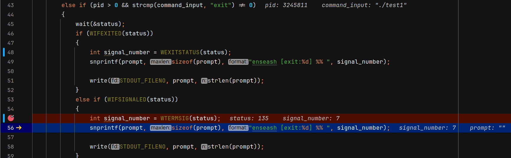
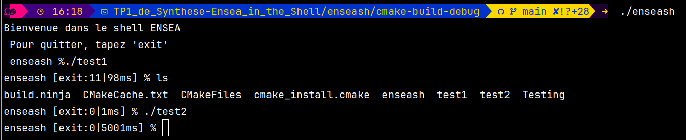

# Compte rendu, BLARET Julien LABROUSSE Sédrenn
2G1 TD3 TP6 | ENSEA 2024

## TP de Synthèse – Ensea in the Shell

**Objectifs :** Réaliser un micro shell, affichant les codes de sortie et les temps d’exécution
des programmes lancés.

### Question 1 : [code question 1](../enseash/question1.c)

**Objectif :** Créer un micro shell qui affiche un message d’accueil à l’utilisateur, suivi d’un prompt, enseash %, en attente de commande.

Dans cette première étape, l’objectif est de poser les bases de notre micro shell. Cela inclut :

L’affichage d’un message d’accueil clair et informatif.
La mise en place d’une boucle REPL (Read-Eval-Print Loop), qui laisse le programme actif en attente de commandes utilisateur.
Implémentation :
Nous avons écrit une fonction welcome() qui utilise la fonction système write() pour afficher le message d’accueil. Nous avons choisi d’éviter printf pour respecter les consignes du TP et pour mieux gérer les interactions avec les descripteurs de fichier.

**Problèmes rencontrés :**
Lors de notre premier test, nous avons rencontré un problème inattendu lié à un oubli dans l’initialisation des chaînes de caractères ou dans l’utilisation des descripteurs. Cela a conduit à un comportement étrange :

_We have a ghost in the shell_

Après avoir corrigé notre code, notamment en assurant une bonne gestion des chaînes de caractères et des fonctions système, nous avons obtenu le résultat attendu :

Bilan :
Cette question constitue une base solide pour construire les étapes suivantes. À ce stade, notre shell affiche correctement son message d’accueil et reste fonctionnel en attente de commandes. Cependant, il est limité par l’absence de gestion de commande ou de sortie.
Le but de cette question est de créer un micro shell et d'afficher un message d'acceuil. 
A noter qu'à ce stade, nous ne pouvons pas quitter le programme avec *exit*, nous devons donc utiliser **ctrl+C** pour l'instant

### Question 2 : [code question 2](../enseash/question2.c)

**Objectif :** Permettre l’exécution de commandes simples saisies par l’utilisateur, avec retour au prompt après chaque commande.

**Implémentation :**
Nous avons ajouté deux fonctions principales :

command_input(), qui lit la commande et crée un processus enfant avec fork() pour son exécution.
command_execution(), qui utilise execlp() pour exécuter la commande saisie.
Le parent attend la fin du processus enfant via wait() et réaffiche le prompt enseash %. En cas de commande invalide, un message "ERROR" est affiché.

**Tests :**
La commande ls s’exécute correctement :

Ensuite nous pouvons executer cette foncion avec une commande simple, ici la commande fortune, qui nous affiche une citation aléatoire. 

Bilan :
Le shell est maintenant fonctionnel pour exécuter des commandes simples, mais ne gère pas encore la sortie ou les arguments complexes.

### Question 3 : [code question 3](../enseash/question3.c)

Le but de cette question est de permettre la sortie du shell avec la commande exit ou un Ctrl+D.

**Implémentation :**
Nous avons ajouté une vérification de la commande saisie dans la boucle principale. Si la commande est "exit", un message d’adieu est affiché et le programme se termine proprement avec exit(0).

Cependant, pour Ctrl+D, nous avons également modifié le comportement de la fonction read(). Si read() retourne 0 (indiquant une fin de fichier), le programme détecte cet événement et quitte avec un message similaire.

**Tests :**
Voici un exemple de test avec la commande "exit" :

On voit bien le message "Bye bye" et la terminaison du programme.

**Problèmes rencontrés :**
Lors de l'implémentation, une erreur initiale apparaissait si le remplacement du caractère \n par \0 n’était pas correctement géré. Une fois corrigée, tout a fonctionné comme prévu.
Nous avons également réussi à créer notre premier virus, du à un mauvais placement de l'Exit, et du fait de tuer le père du processus père, aka le PC. 
cf 

**Résultat final :**
Nous avons un prompt fonctionnel qui gère correctement :
  - La commande "exit" pour quitter le programme.
  - Ctrl+D pour détecter la fin de fichier et quitter proprement.
    

### Question 4 : [code question 4](../enseash/question4.c)

**Objectif :** Afficher, dans le prompt, le code de retour ou le signal associé à la commande précédente. Cela permet de fournir des informations utiles sur l’exécution des commandes, notamment :

  - Le code de sortie pour une commande terminée normalement (exit:N).
  - Le signal ayant causé l’arrêt d’une commande si elle a été interrompue (sign:N).

Pour ce faire on a créé 2 programmes test, presents dans test_q4 :
  - test1 [code test1](../test_q4/test1.c) renverra un segmentation fault
  - test2 [code test1](../test_q4/test2.c) testera un temps de 5s

Après avoir fait nos codes, nous avons pu tester la fonction test1

On voit bien qu'on nous retourne une erreur, ici 7 qui correspond à BUS FAULT. Mais on obtient aussi parfois le code 11 qui correspond au SEGMENTATION FAULT

### Question 5 : [code question 5](../enseash/question5.c)  

**Objectif :** Ajouter la mesure du temps d’exécution des commandes en utilisant l’appel système `clock_gettime`. Cette mesure doit être incluse dans le prompt après chaque commande, en millisecondes.

**Implémentation :**  
Nous avons ajouté :
1. Des appels à `clock_gettime` pour capturer le temps avant et après l’exécution de chaque commande.
2. Une formule pour convertir la différence entre les temps en millisecondes.
3. Une intégration de cette mesure dans le prompt affiché à l’utilisateur.

Nous obtenons le resultat escompté.

### Question 6 : [code question 6](../enseash/question6.c)

**Objectif :** Permettre l’exécution de commandes complexes avec des arguments (par exemple, `ls -l` ou `echo Hello World`).  

**Implémentation :**  
Pour ajouter la gestion des arguments, nous avons utilisé les étapes suivantes :
1. La commande utilisateur est segmentée en arguments à l’aide de `strtok`, qui divise la chaîne en tokens séparés par des espaces.
2. Les arguments ainsi obtenus sont stockés dans un tableau `argv`.
3. Ce tableau est passé à la fonction `execvp`, qui exécute la commande avec ses arguments.

### Question 7 : [code question 7](../enseash/question7.c)

**Objectif :** Ajouter la gestion des redirections de fichiers avec les opérateurs `<` (entrée standard) et `>` (sortie standard). Cela permettrait de rediriger la sortie d’une commande vers un fichier ou d’utiliser un fichier comme entrée pour une commande.  

**Implémentation :**  
Pour implémenter cette fonctionnalité :  
1. Identification des opérateurs `<` et `>` dans les arguments à l’aide de `findCharPosition`.  
2. Manipulation des descripteurs de fichier avec `dup2` pour rediriger les flux d’entrée ou de sortie.  
3. Suppression des opérateurs et de leurs arguments associés dans la liste `argv` avant d’appeler `execvp`.  

Nous n'avons malheuresement pas réussi à faire fonctionner cette dernière partie.

